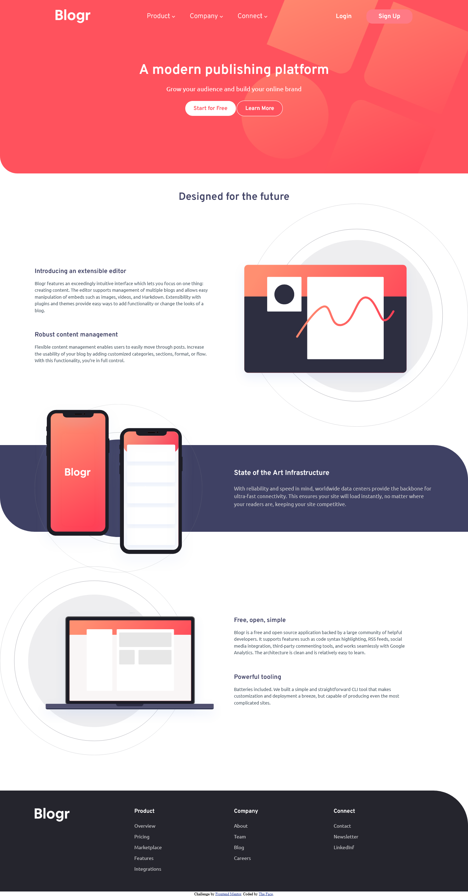

# Frontend Mentor - Blogr landing page solution

This is my solution to the [Blogr landing page challenge on Frontend Mentor](https://www.frontendmentor.io/challenges/blogr-landing-page-EX2RLAApP).

### Screenshot

### Links

- Solution URL: [Check solution]()
- Live Site URL: [Visit live site](https://thefaceblogr.vercel.app)

## My process

### Built with

- Semantic HTML5 markup
- CSS custom properties
- JavaScript

## Author

- Portfolio - [Ezekiel The Face](https://thefacecodes.web.app)
- Frontend Mentor - [@iamtheface](https://www.frontendmentor.io/profile/iamtheface)
- Twitter - [@thefacecodes](https://www.twitter.com/thefacecodes)
